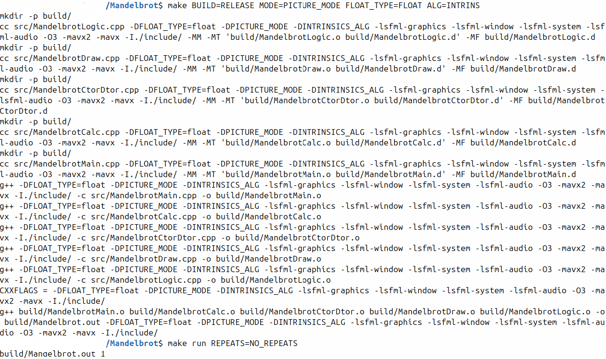
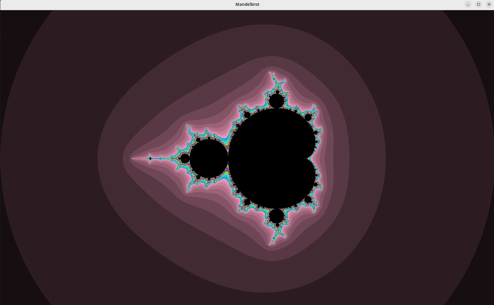

#  Mandelbrot
 &emsp;
 &emsp;
  &emsp;  &emsp;
 

В данном проекте основной целью было оптимизировать построение
[**множества Мандельброта**](https://ru.wikipedia.org/wiki/%D0%9C%D0%BD%D0%BE%D0%B6%D0%B5%D1%81%D1%82%D0%B2%D0%BE_%D0%9C%D0%B0%D0%BD%D0%B4%D0%B5%D0%BB%D1%8C%D0%B1%D1%80%D0%BE%D1%82%D0%B0) - классической задачи на параллелизм с помощью различных методов, в том числе использующих поддержку на аппаратном уровне.

 ## Введение 📜

Данное множество строится с помощью формулы: <br>
> $Z_n = Z_{n-1}^2 + Z_0$ <br>

где $Z_0$ - фиксированная точка на комплексной плоскости. <br>

 Выражение в координатах выглядит следующим образом: <br>
> $x_{n+1} = x_n^2 - y_n^2 + x_0$ <br>
$y_{n+1} = 2x_ny_n ~~~  + y_0$

Суть в том, что от выбора начальной точки зависит попадёт ли конкретная точка спустя $n$ количество итераций в данное множество или нет. Используя функцию раскраски каждой точки в зависимости от $n$, мы получаем картинку.

## Алгоритмы оптимизации
1. Простое построение без оптимизации
2. Оптимизация с ручной векторизацией
3. Использование [**интринсиков**](https://www.intel.com/content/www/us/en/support/ru-banner-inside.html)
4. Разворачивание циклов с интринсиками

## Сборка на Linux x86-64
Для сборки достаточно написать в коммандной строке
```bash
make
```
### Параметры сборки
Если вы хотите использовать собственные настройки, вы можете использовать  специальные флаги:
> Подчёркнутый текст будет означать настройки по умолчанию

- **Использование доп. проверок**&emsp; ```BUILD=...```
    - <u>Релизный</u>&emsp; &emsp; ```BUILD=RELEASE```
    - Отладочный &emsp;```BUILD=DEBUG ```

- **Режим отображения**&emsp;```MODE=...```

    - <u>Графический</u>
        &emsp; &emsp; ```MODE=PICTURE_MODE```
    - Сбор статистики &emsp;```MODE=STAT_MODE ```
------
- **Использование алгоритма** &emsp; ```ALG=...```
    - Без отпимизаций (не считая компилятора) &emsp; ```ALG=SIMPLE```
    - C наивным алгоритмом &emsp; ```ALG=NATIVE```
    - C интринсиками &emsp; ```ALG=INTRINS```
    -  <u>C ускорением интринсиков</u> &emsp; ```ALG=INTRINS_FAST```
------
- **Тип чисел с плавающей запятой** &emsp; ```FLOAT_TYPE=...```

    - <u>Использование *float*  в алгоритме</u>
        &emsp; &emsp; &emsp; &emsp; &emsp;```FLOAT_TYPE=FLOAT```
    - Использование *double* в алгоритме &emsp; &emsp; &emsp; &emsp; ```FLOAT_TYPE=DOUBLE```
    - Использование *long double* в алгоритме &emsp; ```FLOAT_TYPE=LONG_DOUBLE```

    > ⚠️ **Warning**<br>
    > Тип long double поддерживается только для простого и нативного алгоритмов

## Запуск
Для этого достаточно написать
```bash
make run
```
### Параметр запуски
- **Количество повторений расчёта одной очки:** &emsp; ```REPEATS=...```
    - <u>Без повторений (отрисовка 1 раз)</u> &emsp; ```REPEATS=NO_REPEATS```
    - Натуральное число: &emsp; &emsp; &emsp; &emsp; &emsp;&emsp;&emsp;```REPEATS=n```,  &emsp; где $n \in \mathbb{N},$&emsp;1 < $n$ < 1000

    > ⚠️ **Warning**<br>
    > Не запускайте программу с $n$, выходящим из диапазона, написанного ранее.

## Графический режим
Для этого режима доступен функционал:
- Перемещение по графику
    - ```W``` - вверх
    - ```A``` - влево
    - ```S``` - вниз
    - ```D``` - вправо

- Zoom графика
    - ```Cntl +```&emsp;- увеличение
    - ```Cntl -```&emsp;- уменьшение

- Изменение количества итераций для каждой точки
    - ```↑``` - увеличение
    - ```↓``` - уменьшение

- Завершение программы
    - ```Esc```
## Пример работы
Сначала собёрем проект:
```bash
make BUILD=RELEASE MODE=PICTURE_MODE ALG=INTRINS FLOAT_TYPE=FLOAT
```
Далее запустим:
```
make run REPEATS=NO_REPEATS
```
В результате в консоли вы увидете следующее:


А также на экране появится окно:



## Использование на Linux x86-64
Для того чтобы успешно использовать на своём оборудовании данный проект достаточно выполнить следуюущие комманды:
```bash
sudo apt update
sudo apt install libsfml-dev
git clone https://github.com/dangerUser45/Mandelbrot/
cd Mandelbrot
```

## Полученные оптимизации
Время прорисовки экрана 1600x960 пикселей в миллисекундах для 10 повторений в режиме статистики (MODE=STAT_MODE)

|                   | float        | double       | long double |
|:------------------|:------------:|:------------:|:-----------:|
| simple            |  1028  ± 13  |  1036  ± 15  |  1156 ± 15  |
| native            |  144   ± 1   |  259   ± 3   |      -      |
| intrinsics        |  146   ± 1   |      -       |      -      |
| unroll intrinsics |  66.0  ± 0.5 |      -       |      -      |
